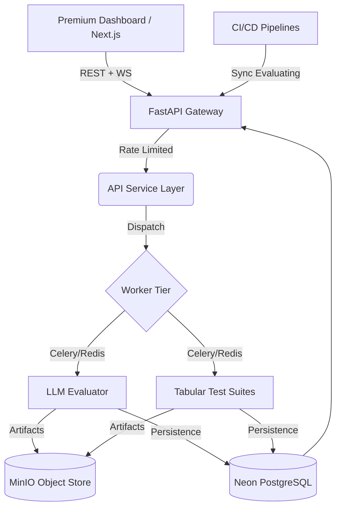

# FireFlink ML Guard: Enterprise AI Governance Platform (v7.2)

## The Gold Standard in Machine Learning Reliability & LLM Governance

ML Guard brings FireFlink's scriptless testing excellence to both Tabular Machine Learning and Generative AI (LLMs). It serves as a mathematically rigorous "Quality Gate" that ensures models are accurate, safe, stable, and ethically sound before reaching production.


---

## 🚀 What's New in v7.2?

The latest evolution of ML Guard introduces the **Enterprise Governance Suite**, providing deep visibility into the model lifecycle and compliance certificate generation.

### 🔬 Multi-Modal Governance
- **Tabular Models**: Deep audit of Data Quality, PSI Drift, Performance, Robustness, and Fairness.
- **Generative AI (LLMs)**: Local-first evaluation for Hallucinations, Toxicity, Bias, and Injection robustness.

### 🛡️ v7.2 Enterprise Features
- **Scan History & Compare**: Track every governance audit with side-by-side metric comparison and **Trajectory Sparklines** for model health trends.
- **Model Report Cards**: Professional, exportable, and printable compliance certificates consolidating scores, policy gates, and statistical proof.
- **Live Notifications**: Real-time alerting bell with severity-based flyout for critical governance events.
- **Predictive Governance (NEW)**: 30-day risk trajectory forecasting using **Facebook Prophet** and **Scikit-learn** to predict and block future policy breaches before they occur.

### 🌐 Modern Infrastructure
- **Serverless Data Tier**: Powered by **Neon PostgreSQL** and **Upstash Redis** for global scalability.
- **Object Storage**: **MinIO** integration for secure, S3-compatible model and dataset artifact management.

---

## 📋 Table of Contents

- [Core Capabilities](#-core-capabilities)
- [Generative AI (LLM) Engine](#-generative-ai-llm-engine)
- [Quick Start](#-quick-start)
- [Architecture](#-architecture)
- [Test Categories](#-test-categories)
- [CI/CD Integration](#-cicd-pipeline-integration)

---

## 💎 Core Capabilities

*   **⚡ Zero-Block Execution**: Asynchronous processing ensures your UI remains responsive while the worker tier handles complex benchmarking.
*   **📜 Compliance Certificates**: Generate "Report Cards" that serve as official proof-of-governance for risk management stakeholders.
*   **📈 Trajectory Analysis**: Monitor how your model's governance score evolves over time with built-in trend visualization.
*   **🚫 Automated Quality Gates**: Block CI/CD pipelines automatically if models fail any critical governance criteria.

---

## 🤖 Generative AI (LLM) Engine

The v7.2 engine provides a comprehensive suite for auditing Large Language Models (OpenAI, HuggingFace, Custom Inference) with deterministic, local checks.

| Domain | Metrics & Audits | Governance Goal |
| :--- | :--- | :--- |
| **Integrity** | Hallucination Rate, Knowledge Score | Truthfulness & Accuracy |
| **Safety** | Toxicity Score, Injection Robustness | Content Safety & Security |
| **Ethics** | Bias Score, Stereotype Detection | Fairness & Neutrality |
| **Reliability** | Consistency Index, Latency Benchmarking | Production Stability |

---

## 🏗️ System Architecture



### Tech Stack
- **Frontend**: Next.js 18, React, Tailwind CSS, Lucide
- **Backend**: FastAPI, Pydantic, SQLAlchemy, JWT
- **Orchestration**: Celery, Upstash Redis
- **Persistence**: Neon PostgreSQL (Serverless)
- **Object Store**: MinIO (S3-Compatible)
- **Math Engine**: scikit-learn, Pandas, SciPy, Custom PSI Engine

---

## 🧪 Test Categories

1. **Data Quality**: Schema validation, uniqueness, row density, missing entropy.
2. **Statistical Stability**: PSI Drift (Population Stability Index), KS Divergence.
3. **Model Performance**: Accuracy, F1-Score, ROC-AUC, Overfitting gap.
4. **Robustness**: Input perturbation, stress testing, adversarial resilience.
5. **Bias & Fairness**: Protected attribute parity, subgroup performance analysis.
6. **LLM Safety**: Hallucination risks, jailbreak resistance, toxicity audits.

---

## 🛡️ CI/CD Pipeline Integration (v7.2)

ML Guard v7.2 introduces a **Synchronous Governance Gate** for direct integration into DevOps pipelines.

### Policy-as-Code (`mlguard.yaml`)
Define your release thresholds in a simple declarative file kept alongside your model code:

```yaml
version: "1.0"
model_name: "CustomerChurnPredictor-V2"
max_psi: 0.15
min_accuracy: 0.88
max_hallucination_rate: 0.04
bias_parity_threshold: 0.1
```

### ML Guard CLI
The `mlguard` tool provides immediate governance feedback in the terminal:

```bash
# Check model artifact against policy
python ml_guard/sdk/python/mlguard_cli.py check --policy mlguard.yaml --artifact models/latest_model.pkl

# Probe a production endpoint for safety
python ml_guard/sdk/python/mlguard_cli.py check --policy mlguard.yaml --url https://api.prod.inference.internal
```

### GitHub Actions Integration
Automatically block PR merges if a model fails any governance signal:

```yaml
jobs:
  governance:
    steps:
      - uses: actions/checkout@v3
      - name: ML Guard Gate
        run: |
          mlguard check --policy mlguard.yaml --artifact model_v2.pkl
```

Exits with `code 1` on failure, ensuring no non-compliant model reaches production.

---

## 📈 Predictive Governance & Forecasting

ML Guard v7.2 includes a predictive layer that analyzes historical audit trends to forecast future risks.

### Forecasting Model Selection
- **Deep History (≥10 points)**: Utilizes `Facebook Prophet` with daily seasonality to capture complex temporal patterns.
- **Sparse Data (<10 points)**: Falls back to `Ordinary Least Squares (OLS)` linear regression for stable trend extrapolation.

### Installation (Prophet)
To enable the forecasting tier, ensure the following dependencies are installed:
```bash
# Required for Prophet on Windows/Linux
pip install pystan==2.19.1.1
pip install prophet
```

### Risk Summary Features
- **Breach Prediction**: Identifies the exact date a metric (e.g. PSI) is expected to cross a policy threshold.
- **Confidence Intervals**: Shaded uncertainty regions (95% CI) visualized in the dashboard.
- **Trend Direction**: Real-time classification of metrics as `IMPROVING`, `STABLE`, or `DEGRADING`.

---

## 🔭 Production Observability (v7.2 — Governance-First)

ML Guard v7.2 now includes a full **production monitoring layer** that goes beyond what Evidently AI and Arize AI offer — by directly linking live monitoring signals to the governance engine.

### Architecture

```
Production Inference → SDK / API
         ↓
POST /api/v1/ingest/predict         ← Single prediction (async, non-blocking)
POST /api/v1/ingest/batch           ← Up to 10,000 rows via Celery
POST /api/v1/ingest/label           ← Stitch ground truth after the fact

         ↓

Celery Beat (Hourly)                ← run_hourly_drift_scan
Celery Beat (Every 6h)              ← run_performance_snapshot

         ↓

GET /api/v1/observe/feed            ← Global command center (all models)
GET /api/v1/observe/{model_id}/overview
GET /api/v1/observe/drift/{model_id}/report
GET /api/v1/observe/performance/{model_id}/live
```

### Module 1 — Prediction Ingestion Pipeline

Log every prediction from production with zero-latency:

```python
# Python SDK snippet
from mlguard import MLGuardClient
client = MLGuardClient(host="http://localhost:8000", api_key="your-key")

client.log(
    model_id="churn-v2",
    features={"age": 34, "income": 75000},
    prediction=1,
    proba=0.87
)
```

Or directly via the API:

```bash
curl -X POST http://localhost:8000/api/v1/ingest/predict \
  -H "Content-Type: application/json" \
  -d '{"model_id":"churn-v2","features":{"age":34},"prediction":1,"prediction_proba":0.87}'
```

### Module 2 — Feature-Level Drift Monitor

Per-feature statistical drift analysis. Equivalent to Evidently's column-level reports:

| Feature | Type | Method | Metrics |
| :--- | :--- | :--- | :--- |
| Numerical | Float/Int | KS Test | p-value, statistic, PSI, Wasserstein, mean shift % |
| Categorical | String/Bool | Chi-squared | p-value, new category detection, distribution shift |

```
GET /api/v1/observe/drift/{model_id}/report?window_hours=24&method=ks
POST /api/v1/observe/drift/{model_id}/set-baseline
GET /api/v1/observe/drift/{model_id}/features?feature=age
```

Reference distributions stored as parquet in MinIO: `baselines/{model_id}/reference.parquet`

### Module 3 — Live Performance Degradation Tracker

Computes real-time metrics once ground truth labels arrive:

| Task | Metrics |
| :--- | :--- |
| Classification | Accuracy, F1, Precision, Recall, ROC-AUC, Log Loss |
| Regression | RMSE, MAE, R², MAPE |

**Slice Analysis** — detects if model fails for specific subgroups:

```
POST /api/v1/observe/performance/{model_id}/slice
{"slice_feature": "age_bracket", "window_hours": 24}
```

### Module 4 — Unified Dashboard

`Observability` nav item in the **Live Guard** section of the dashboard provides:

- **Global Feed**: All models ranked by governance health score, drift severity, prediction volume
- **Model Overview**: Live health cards (predictions, latency, drift badge, governance score)
- **Drift Analysis**: Per-feature drift table + distribution comparison charts
- **Performance Timeline**: Multi-metric line chart with baseline reference line

### Module 5 — Governance-Linked Observability (Your Moat)

**Live Governance Score Decay** — unique to ML Guard:

```
live_score = base_audit_score × (1 - drift_penalty) × (1 - perf_penalty)

drift_penalty = min(0.30, overall_drift_score)
perf_penalty  = max(0, baseline_accuracy - current_accuracy) × 2
```

This score **decays in real-time** as production drift is detected and **recovers** only after a re-audit — creating a continuous compliance feedback loop that static audit tools cannot provide.

**Auto-Governance Trigger**: When drift crosses HIGH/CRITICAL threshold, a full governance audit (bias, fairness, LLM safety) is automatically dispatched via Celery.

---

## 📄 License & Status

- **Status**: Production-Ready (v7.2.0)
- **License**: MIT
- **Support**: (c) 2026 Antigravity AI Systems

---

**ML Guard** - Bringing FireFlink's testing excellence to the frontiers of AI. 🚀
