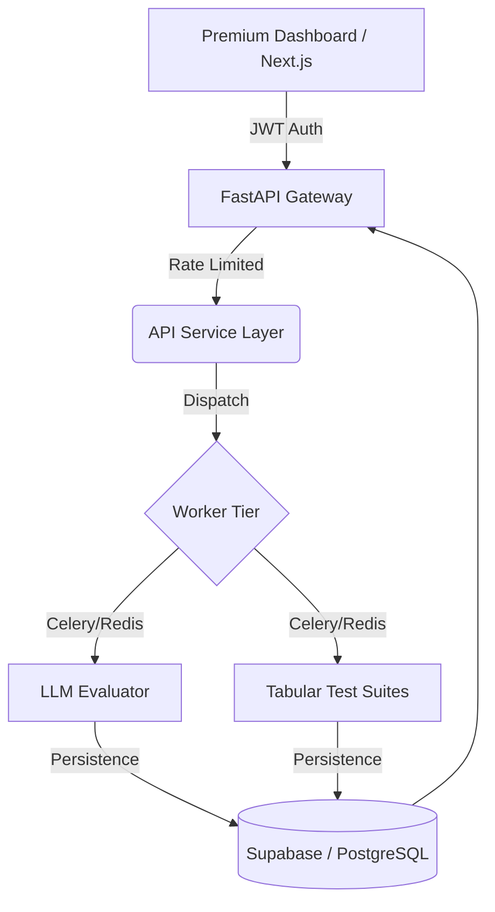

# FireFlink ML Guard: Enterprise AI Governance Platform (v4.0)

## The Gold Standard in Machine Learning Reliability & LLM Governance

ML Guard brings FireFlink's scriptless testing excellence to both Tabular Machine Learning and Generative AI (LLMs). It serves as a mathematically rigorous "Quality Gate" that ensures models are accurate, safe, stable, and ethically sound before reaching production.


---

## � What's New in v4.0?

The latest evolution of ML Guard introduces the **Generative AI Governance Engine**, expanding our reach from traditional predictive models to the frontiers of LLMs.

### 🔬 Multi-Modal Governance
- **Tabular Models**: Deep audit of Data Quality, PSI Drift, Performance, Robustness, and Fairness.
- **Generative AI (LLMs)**: Enterprise-grade evaluation for Hallucinations, Toxicity, Bias, Knowledge Alignment, and Jailbreak robustness.

### 🛡️ Intelligent Infrastructure
- **Async Worker Tier**: Powered by **Celery & Redis** for heavy evaluation workloads (up to 2-minute deep-benchmarking).
- **FastAPI Pro Tier**: Hardened backend with **Rate Limiting**, **Explicit Binding (127.0.0.1)**, and **JWT-based Security**.
- **Pre-flight Telemetry**: Automated artifact inspection (Fingerprinting, entropy checks, and compatibility verification) before execution.

---

## 📋 Table of Contents

- [Core Capabilities](#-core-capabilities)
- [Generative AI (LLM) Engine](#-generative-ai-llm-engine)
- [Quick Start](#-quick-start)
- [Architecture](#-architecture)
- [Test Categories](#-test-categories)
- [API Reference](#-api-reference)

---

## 💎 Core Capabilities

*   **⚡ Zero-Block Execution**: Asynchronous processing ensures your UI remains responsive while the worker tier handles gigabyte-scale data profiling.
*   **🧠 NL-Intent Alignment**: Describe security objectives in plain English; the engine orchestrates the required statistical tests dynamically.
- **📊 Premium Telemetry**: High-fidelity dashboard providing real-time scanning progress, feature influence vectors, and risk-level heatmaps.
*   **🚫 Automated Quality Gates**: Block CI/CD pipelines automatically if models fail any critical governance criteria.

---

## 🤖 Generative AI (LLM) Engine

The v4.0 engine provides a comprehensive suite for auditing Large Language Models (OpenAI, HuggingFace, Custom Inference).

| Domain | Metrics & Audits | Governance Goal |
| :--- | :--- | :--- |
| **Integrity** | Hallucination Rate, Knowledge Score | Truthfulness & Accuracy |
| **Safety** | Toxicity Score, Jailbreak Robustness | Content Safety & Security |
| **Ethics** | Bias Score, Stereotype Detection | Fairness & Neutrality |
| **Reliability** | Consistency Index, Latency Benchmarking | Production Stability |

---

## � Quick Start

### 1. Environment Setup
```bash
# Clone the repository
git clone https://github.com/fireflink/ml-guard.git
cd ml-guard/ml_guard/backend

# Initialize venv
python -m venv venv
venv\Scripts\activate

# Install Enterprise dependencies
pip install -r requirements.txt
```

### 2. Launch Tier-1 (API)
```bash
# Start backend on local loopback
uvicorn app.main:app --host 127.0.0.1 --port 8000
```

### 3. Launch Tier-2 (Worker)
```bash
# Start Celery worker for async evaluations
celery -A app.core.celery_app worker --loglevel=info
```

### 4. Health Check
- **Portal**: http://localhost:8000/
- **Health System**: http://localhost:8000/health
- **Swagger Specs**: http://localhost:8000/docs

---

## 🏗️ System Architecture



### Tech Stack
- **Frontend**: Next.js, React, Tailwind CSS, Lucide
- **Backend**: FastAPI, Pydantic, SQLAlchemy, JWT
- **Orchestration**: Celery, Redis
- **Persistence**: Supabase (PostgreSQL)
- **Math Engine**: scikit-learn, Pandas, SciPy, Custom PSI Engine

---

## 🧪 Test Categories

1. **Data Quality**: Schema validation, uniqueness, row density, missing entropy.
2. **Statistical Stability**: PSI Drift (Population Stability Index), KS Divergence.
3. **Model Performance**: Accuracy, F1-Score, ROC-AUC, Overfitting gap.
4. **Robustness**: Input perturbation, stress testing, adversarial resilience.
5. **Bias & Fairness**: Protected attribute parity, subgroup performance analysis.
6. **LLM Safety (NEW)**: Hallucination risks, jailbreak resistance, toxicity audits.

---

## 📄 License & Status

- **Status**: Production-Ready (v4.0.0)
- **License**: MIT
- **Support**: (c) 2026 Antigravity AI Systems

---

**ML Guard** - Bringing FireFlink's testing excellence to the frontiers of AI. 🚀
