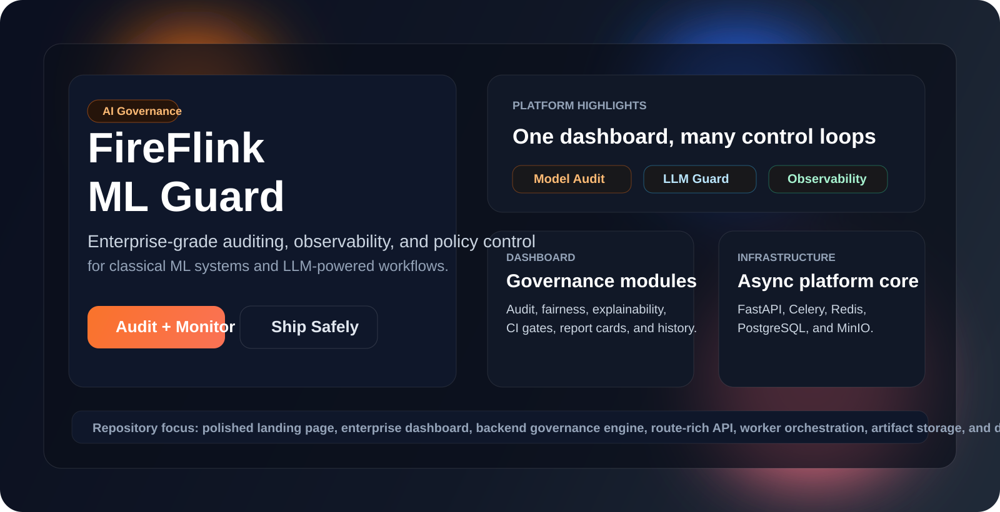
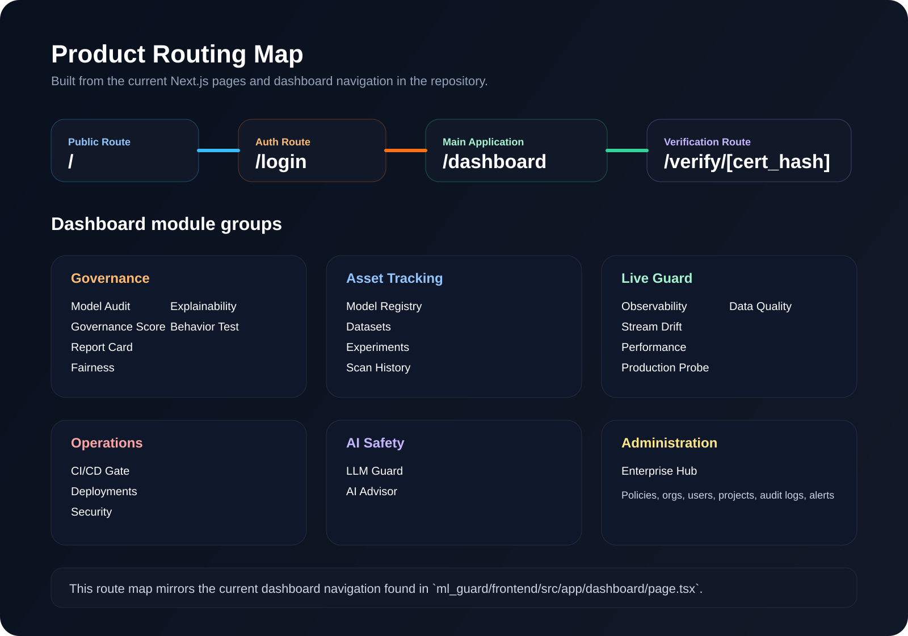
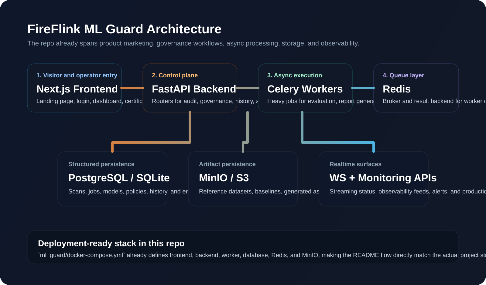

# FireFlink ML Guard

<p align="center">
  
</p>

<p align="center">
  <a href="#project-tour">Project Tour</a> •
  <a href="#platform-routing">Platform Routing</a> •
  <a href="#architecture">Architecture</a> •
  <a href="#quick-start">Quick Start</a> •
  <a href="#repo-map">Repo Map</a>
</p>

<p align="center">
  
  
  
  
</p>

FireFlink ML Guard is a full-stack AI governance platform for auditing, monitoring, and operationalizing machine learning systems and LLM workflows. The repository contains a polished marketing landing page, a multi-module enterprise dashboard, a FastAPI backend with broad governance endpoints, background workers, storage integrations, and deployment-ready infrastructure.

## Project Tour

<p align="center">
  
</p>

### What the platform covers

- Model audit workflows for tabular ML evaluation, drift checks, fairness analysis, explainability, and governance scoring
- LLM safety workflows for prompt-response evaluation, hallucination checks, toxicity review, and advisory tooling
- Operational guardrails such as CI/CD gates, live monitoring, notifications, policies, and enterprise-level audit history
- Lifecycle management for models, datasets, experiments, deployments, and report-card generation

### Visitor experience

- `/` presents a strong product-style landing page built from custom sections like Hero, Frameworks, Features, How It Works, dashboard previews, docs, and contact areas
- `/login` provides the authenticated entry point into the platform
- `/dashboard` opens the main enterprise console with grouped navigation for governance, tracking, monitoring, operations, AI safety, and administration
- `/verify/[cert_hash]` supports certificate verification flows

## Platform Routing

### Frontend routes

| Route | Purpose |
| --- | --- |
| `/` | Product landing page and repo-facing first impression |
| `/login` | Auth entry point |
| `/dashboard` | Main app shell with all platform modules |
| `/verify/[cert_hash]` | Compliance/report-card verification |

### Dashboard navigation

| Navigation Group | Modules in the UI |
| --- | --- |
| Governance | Model Audit, Governance Score, Report Card, Fairness, Explainability, Behavior Test |
| Asset Tracking | Model Registry, Datasets, Experiments, Scan History |
| Live Guard | Observability, Stream Drift, Performance, Production Probe, Data Quality |
| Operations | CI/CD Gate, Deployments, Security |
| AI Safety | LLM Guard, AI Advisor |
| Administration | Enterprise Hub |

### Backend route families

| Route Family | Examples |
| --- | --- |
| Audit and evaluation | `/api/v1/audit/run`, `/api/v1/fairness/analyze`, `/api/v1/llm/evaluate` |
| Governance and policy | `/api/v1/governance/{job_id}`, `/api/v1/policies`, `/api/v1/gate/*` |
| History and enterprise | `/api/v1/history`, `/api/v1/compare`, `/api/v1/enterprise/*` |
| Monitoring and ingest | `/api/v1/ingest/*`, `/api/v1/observe/*`, `/api/v1/stream/*`, `/api/v1/monitoring/log` |
| Ops and automation | `/api/v1/alerts/*`, `/api/v1/ci/*`, `/api/v1/forecast/*`, `/api/v1/advisory/*` |

## Architecture

<p align="center">
  
</p>

### High-level flow

1. Users enter through the Next.js landing page and authenticated dashboard.
2. The dashboard calls the FastAPI backend for audit jobs, history, policy data, monitoring feeds, and report workflows.
3. Celery workers process heavy governance tasks asynchronously using Redis.
4. PostgreSQL stores structured platform state, while MinIO handles artifacts and reference assets.
5. WebSocket and live-monitoring endpoints feed operational signals back into the UI.

## Quick Start

### Local app layout

- `ml_guard/frontend` contains the Next.js app
- `ml_guard/backend` contains the FastAPI API, workers, services, and governance logic
- `ml_guard/docker-compose.yml` wires up frontend, backend, Redis, Postgres, and MinIO

### Fastest way to run

```bash
cd ml_guard
docker-compose up --build
```

Expected local services:

- Frontend: `http://localhost:5174`
- Backend: `http://localhost:8001`
- MinIO console: `http://localhost:9001`

### Manual development

Backend:

```bash
cd ml_guard/backend
pip install -r requirements.txt
uvicorn app.main:app --host 127.0.0.1 --port 8000 --reload
```

Frontend:

```bash
cd ml_guard/frontend
npm install
npm run dev
```

### Key backend dependencies

- FastAPI, SQLAlchemy, Pydantic, Uvicorn
- Pandas, NumPy, scikit-learn, SciPy, SHAP, Fairlearn
- Celery and Redis
- Boto3 for object storage
- ReportLab for generated report artifacts

## Repo Map

```text
real_Fireflink_ML/
|-- README.md
|-- docs/
|   `-- readme-assets/
|-- ml_guard/
|   |-- frontend/         # Next.js landing page + enterprise dashboard
|   |-- backend/          # FastAPI app, routers, services, workers
|   |-- sdk/              # SDK and CLI surface
|   |-- scripts/          # helper scripts
|   |-- docker/           # container support
|   |-- sentinel/         # supporting security/governance layer
|   |-- ARCHITECTURE.md
|   |-- ENTERPRISE_GUIDE.md
|   `-- docker-compose.yml
`-- samples/              # example assets and sample data
```

## Why this repo stands out

- It is not just a model checker. It combines governance, observability, enterprise policy, and LLM safety in one product surface.
- The frontend already behaves like a real platform, with grouped navigation, live status surfaces, and dedicated lifecycle modules.
- The backend is broad enough to support audits, history, policies, alerts, CI integration, artifact handling, monitoring, and streaming workflows.

## Supporting docs

- [Main app README](ml_guard/README.md)
- [Architecture notes](ml_guard/ARCHITECTURE.md)
- [Enterprise guide](ml_guard/ENTERPRISE_GUIDE.md)
- [Auth governance notes](ml_guard/AUTH_GOVERNANCE.md)

## Status

This README was rebuilt from the current codebase structure, frontend routes, backend router inventory, and local deployment files in this repository so visitors get a cleaner, more visual, and more accurate first impression of the project.
