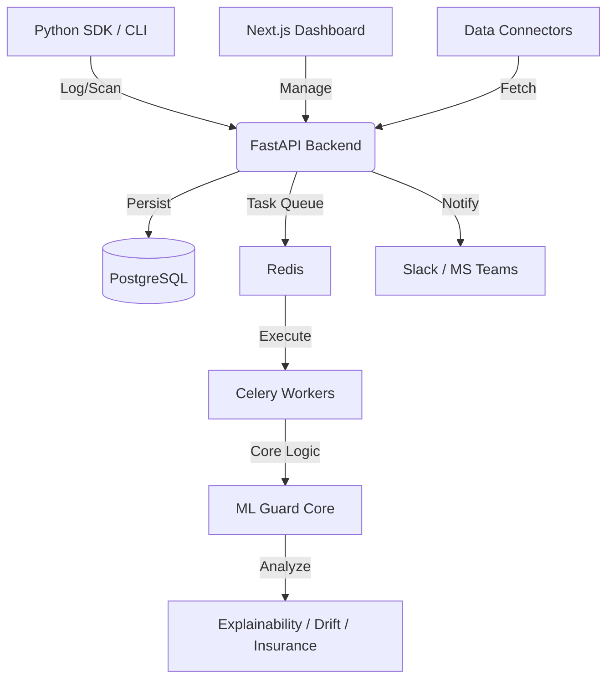

# 🛡️ ML Guard v8.2 — The Enterprise AI Governance Platform

[-blueviolet)](https://github.com/FireFlink/ml_guard)
[](https://github.com/FireFlink/ml_guard)
[](https://github.com/FireFlink/ml_guard)

**ML Guard** is a state-of-the-art AI governance and observability platform designed to bring accountability, security, and behavioral compliance to machine learning models. Beyond simple monitoring, ML Guard implements a **Governance-as-Code** philosophy through its novel Behavioral Contract system, integrating directly into enterprise CI/CD workflows and production runtimes.

---

## 🚀 The Feature Universe (v8.2)

ML Guard is designed to evaluate, monitor, and enforce policy across the entire ML lifecycle. From local development to production pipelines, ML Guard protects your enterprise.

### 1. 📂 AI Bill of Materials (SBOM) & Governance
Maintain a transparent and immutable record of your AI supply chain.
- **Supply Chain Tracking**: Track model lineage, base-model origin, and dataset provenance.
- **Audit Trails**: Full historical record of every model version, evaluation, and certification.
- **Governance Scores**: Multi-dimensional composite grading (Performance, Fairness, Security, Robustness).

### 2. 📑 Actuarial AI Insurance Scoring (New)
The industry's first standardized risk rating system for enterprise AI.
- **Risk Quantization**: Mathematical assessment of model reliability, deployment risk, and incident history.
- **Standardized Rating**: Provides an "Insurance Grade" (A++ to F) based on actuarial risk parameters.
- **Downgrade Alerts**: Automated notification when real-time breaches impact the model's risk tier.

### 3. 🧠 SHAP Governance Explainability
Integrated SHAP (SHapley Additive exPlanations) for deep governance transparency.
- **Fairness Alerts**: Automatically flags when sensitive features (Race, Gender, Age) contribute significantly to model outcomes.
- **Global & Local Explanations**: Visualizes feature importance across the entire dataset and for individual high-risk predictions.
- **Asynchronous Processing**: Background SHAP computation for high-dimensional models without impacting API performance.

### 4. 🔌 Enterprise Data Connector System
Securely ingest data from any enterprise source via our modular plugin architecture.
- **Cloud Storage**: Native connectors for **S3, GCS, and Azure Blob Storage**.
- **Data Warehouses**: Direct ingestion from **Snowflake and BigQuery**.
- **Secure Credentials**: Fernet-encrypted credential management ensuring data source secrets are never leaked.

### 5. 🛑 Behavioral Contracts (The Model Sentinel)
Define behavioral promises that your model must keep. Validated in real-time during every prediction via our Python SDK.
- **Promise Types**: Output confidence ranges, latency SLAs, probabilistic thresholds, and fairness parity bounds.
- **Breach Management**: Automated recording of violations classified by severity (CRITICAL, HIGH, LOW).
- **Live Decay**: Real-world contract breaches directly and automatically penalize the model's live governance score.

### 6. 📊 Real-Time Drift & RAG Observability
High-performance sliding-window drift detection and RAG-specific monitoring.
- **Statistical Distance**: PSI, Kolmogorov-Smirnov (KS-Test), and Jensen-Shannon Divergence.
- **RAG Fidelity**: Grounding assessment, context relevance, and retrieval hit rate tracking.
- **Embedding Drift**: Multi-dimensional vector drift analysis using Cosine similarity and MMD.

### 7. 🔒 LLM Security & Red Teaming
A dedicated suite tailored specifically to Large Language Model governance.
- **Heuristic Toxicity & Hallucination Guardrails**: Systematic analysis of GAI outputs.
- **Adversarial Resiliency**: Active jailbreak vector detection and prompt-injection mitigations.
- **PII Leakage Scanning**: Guarantees generative assets do not exfiltrate sensitive data.

---

## 🏗️ System Architecture

ML Guard operates on an asynchronous microservices architecture designed to run at enterprise scale:



- **Backend API**: Optimized FastAPI service with SQLAlchemy async support.
- **Dashboard**: High-performance Next.js 14 application with Tailwind CSS and Shadcn UI.
- **Core Engine**: Pure Python libraries housing risk algorithms and statistical heuristics.
- **Workers**: Redis-backed Celery cluster for heavy-lift computations (SHAP, Fairness).

---

## 🛠️ Complete Setup Guide

### 1. Requirements
- Node.js 20+
- Python 3.11+
- Redis (For Celery Task Queues)
- PostgreSQL (Recommended for production)

### 2. Backend & Core Setup
```bash
cd ml_guard/backend
python -m venv venv
# Windows: venv\\Scripts\\activate | Mac/Linux: source venv/bin/activate

pip install -r requirements.txt
pip install celery redis mlflow wandb "shap>=0.40.0" cryptography
```

**Environment Configuration (`.env`):**
```ini
SECRET_KEY=your_secure_hash
DATABASE_URL=sqlite:///./ml_guard.db # Or PostgreSQL
REDIS_URL=redis://localhost:6379/0
ENCRYPTION_KEY=your_fernet_key # For Data Connectors
```

**Start Services:**
```bash
# Start API
python -m uvicorn app.main:app --host 0.0.0.0 --port 8000 --reload

# Start Celery Worker (New terminal)
celery -A app.core.celery_app worker --loglevel=info -P solo
```

### 3. Frontend Dashboard
```bash
cd ml_guard/frontend
npm install
npm run dev
```
Dashboard available at `http://localhost:3000`.

---

## 🛡️ CI/CD Integration (The Quality Gate)

Ensure zero "bad models" reach production by integrating the governance gate into your CI pipeline.

**Deterministic Polling with Submission Tokens:**
The latest CI gate uses a UUID-based submission system to ensure stable, parallel-safe evaluation tracking.

```bash
python .github/scripts/ml_guard_ci.py \
  --api-url http://127.0.0.1:8000 \
  --api-key your_api_key \
  --model-name Production-Churn-V2 \
  --model-path ./artifacts/model.pkl \
  --data-path ./data/test_samples.csv \
  --min-score 75
```

---

## 🔌 Ecosystem Integrations

### Outbound Notifications
Real-time breach alerts delivered where your team works:
- **Slack**: Rich Block Kit alerts with performance snapshots.
- **Microsoft Teams**: Adaptive cards for production monitoring.

### Enterprise Connectors
- **S3 / GCS**: Direct ingestion of validation datasets.
- **Snowflake / BigQuery**: Pull production data directly for drift analysis.

---

## 💡 Governance Philosophy
ML Guard transforms subjective "AI Ethics" into objective, measurable, and enforceable technical contracts. By bridging the gap between data science and compliance, we ensure that AI remains a secure, predictable, and fair asset for the enterprise.

---
© 2026 FireFlink ML Research. Proprietary & Confidential.
