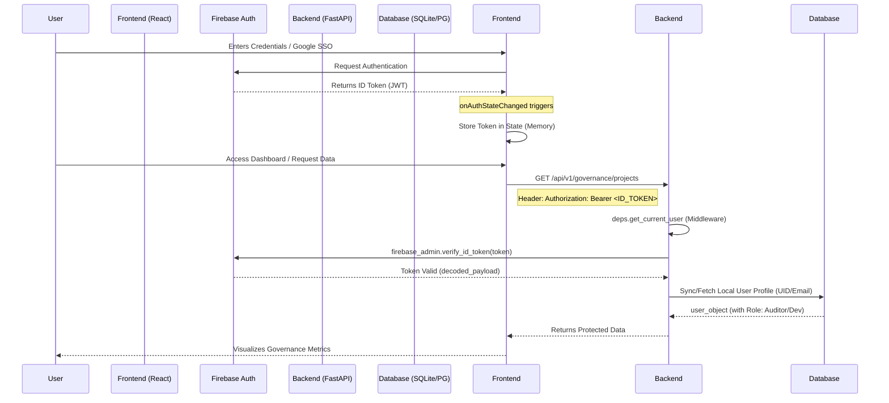

# ML Guard 2.0: Enterprise Authentication & Governance

This document outlines the high-security, production-ready authentication architecture using Firebase and FastAPI.

## 🔒 Security Architecture Overview

The system implements **Identity-as-a-Service (IDaaS)** using Firebase, with a zero-trust backend verification model.

### 1. Unified Authentication Flow

---

## 🛠️ Verification Checklist (Production)

| Task | Status | Requirement |
| :--- | :---: | :--- |
| **Env Validation** | ✅ | No hardcoded API keys; all validated at startup. |
| **Session Persistence** | ✅ | Native Firebase `local` persistence handled by `onAuthStateChanged`. |
| **Silent Refresh** | ✅ | Background interval ensures tokens are rotated before expiry. |
| **Token Scrutiny** | ✅ | `check_revoked=True` enabled in Admin SDK for instant lockout. |
| **CORS Lockdown** | ✅ | Explicit origins only in `main.py`; credentials allowed. |
| **RBAC Enforcement** | ✅ | `check_role(['auditor'])` decorator on compliance routes. |

---

## 🐞 Common Error Causes & Detection

### 1. `401 Unauthorized: Session expired`
- **Cause:** Frontend sending an expired ID token.
- **Detection:** Check if `App.tsx` refresh interval is running. Inspect token expiry (`exp` claim) at [jwt.io](https://jwt.io).
- **Fix:** Ensure `auth.currentUser.getIdToken(true)` is called.

### 2. `403 Forbidden: Security Clearance Denied`
- **Cause:** User exists but `user.role` in local DB is insufficient.
- **Detection:** Check `AuditLog` for "Permission Denied" events.
- **Fix:** Update `users` table via CLI: `UPDATE users SET role='admin' WHERE email='...'`.

### 3. `Firebase initialization failed: Default App already exists`
- **Cause:** Hot Module Replacement (HMR) re-initializing Firebase.
- **Detection:** Console error "Firebase: Firebase App named '[DEFAULT]' already exists".
- **Fix:** Use singleton pattern: `getApps().length > 0 ? getApp() : initializeApp(config)`.

### 4. `Backend 500: Identity verification system failure`
- **Cause:** Missing Service Account JSON or invalid project ID in `backend/.env`.
- **Detection:** Backend logs will show `ValueError` or `CertificateError`.
- **Fix:** Verify `FIREBASE_PROJECT_ID` and ensure `GOOGLE_APPLICATION_CREDENTIALS` points to the valid JSON path.

---

## 🛡️ Best Practices Implemented

1. **Memory-Only Token Storage:** Tokens are kept in React state, not `localStorage`, to mitigate XSS-based token theft. Persistence is handled securely by Firebase's internal indexedDB storage.
2. **Auto-Provisioning:** The backend uses **Just-In-Time (JIT) Provisioning**. The first time a valid Firebase user hits the API, a local shadow profile is created automatically.
3. **Revocation Checks:** Every request verifies the token against the Firebase backend to catch users who have been disabled or signed out from all devices.
4. **Structured Logging:** All auth events (Success, Level Escalation, Failures) are logged to `structlog` for ingestion into SIEM tools like ELK or Datadog.
