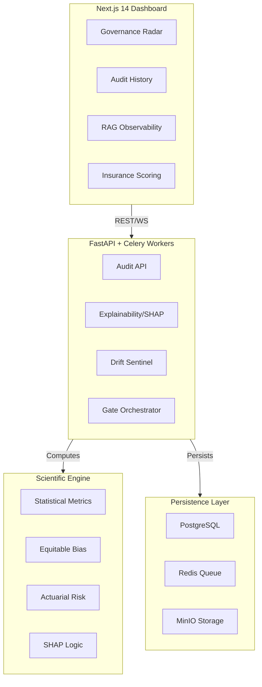

# 🛡️ ML Guard Enterprise — v8.2

## Enterprise AI Governance Platform

ML Guard is a production-grade, multi-tenant platform for comprehensive AI model governance. It provides offline audit, real-time monitoring, bias detection, and SHAP-based explainability through a unified dashboard with deterministic, transparent, and auditable governance logic.

---

## Architecture Overview



---

## v8.2 Feature Matrix

| Module                | Type         | Status    | Features |
|-----------------------|-------------|-----------|----------|
| **Model Audit**           | Classical ML | ✅ Stable | Accuracy, Drift (PSI/KS), Overfitting, Over-confidence |
| **SHAP Explainability**   | Transparency | ✅ **New** | Global feature importance, fairness-drift correlation |
| **Insurance Scoring**     | Actuarial    | ✅ **New** | Standardized risk grades (A++ to F), reliability ratings |
| **RAG Observability**     | GenAI        | ✅ Stable | Grounding, Retrieval Hit Rate, Context Relevance |
| **Data Connectors**       | Enterprise   | ✅ **New** | S3, GCS, Snowflake, BigQuery direct ingestion |
| **Live Monitoring**       | Production   | ✅ Stable | Real-time prediction tracking, latency SLAs |
| **CI/CD Sync Gate**       | Automation   | ✅ Enhanced| Deterministic polling via submission tokens |

---

## Core Modules

### 1. Model Audit (`/api/v1/audit/run`)
Full offline governance scan: accuracy, F1, PSI/KS/JSD drift, overfitting,
calibration, leakage detection, data quality. Produces governance score, risk score,
and enterprise intelligence stream events.

### 2. SHAP Governance Explainability (NEW v8.2)
Deep transparency into model decisions:
- **/api/v1/explain/shap**: Asynchronous background computation of SHapley values.
- **Fairness Integration**: Automatically detects when "protected attributes" become top-k contributors to model decisions.

### 3. Actuarial AI Insurance (NEW v8.2)
Risk-based classification system for enterprise AI:
- **Scoring Engine**: Aggregates Reliability, Robustness, Deployment, and Incident History into a single risk tier.
- **Compliance Mapping**: Technical verification against EU AI Act and NIST RMF standards.

### 4. Enterprise Data Connectors (NEW v8.2)
Modular plugin system for direct ingestion:
- **Storage Connectors**: Securely pull datasets from S3 and Google Cloud Storage.
- **Warehouse Connectors**: Direct SQL execution in Snowflake and BigQuery for production drift baseline creation.

---

## 🛡️ CI/CD Pipeline Integration

### ml_guard_ci.py
The primary automation script for pipelines.

```bash
python .github/scripts/ml_guard_ci.py \
  --api-url http://api.mlguard.enterprise \
  --model-name "CreditRisk-v4" \
  --min-score 80
```

---

## Technical Stack

| Layer     | Technology                              |
|-----------|-----------------------------------------|
| Frontend  | Next.js 14, React, TailwindCSS, Shadcn UI |
| Backend   | FastAPI, SQLAlchemy (Async), Celery     |
| Database  | PostgreSQL                              |
| Cache/Bus | Redis                                   |
| Core      | SHAP, Scikit-learn, NumPy, Pandas, SciPy|

---

## File Structure

```
ml_guard/
├── core/                          # Scientific & Risk engine
├── backend/
│   ├── app/
│   │   ├── main.py               # FastAPI application
│   │   ├── routers/              # Domain-specific controllers
│   │   │   ├── audit.py          | Explainability/SHAP/Monitoring
│   │   │   └── insurance.py      | Actuarial Risk logic
├── plugins/                       # Data Connectors & Notifications
├── sdk/                           # Python Client & CLI
├── frontend/                      # Enterprise Dashboard
└── sentinel/                      # Real-time monitoring agent
```

---

**ML Guard v8.2** — The Platform for Technical AI Governance.
© 2026 FireFlink ML Research. Proprietary & Confidential.
