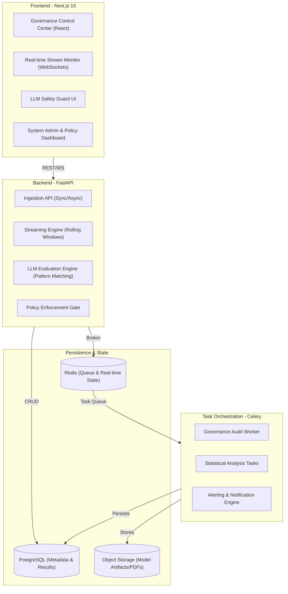
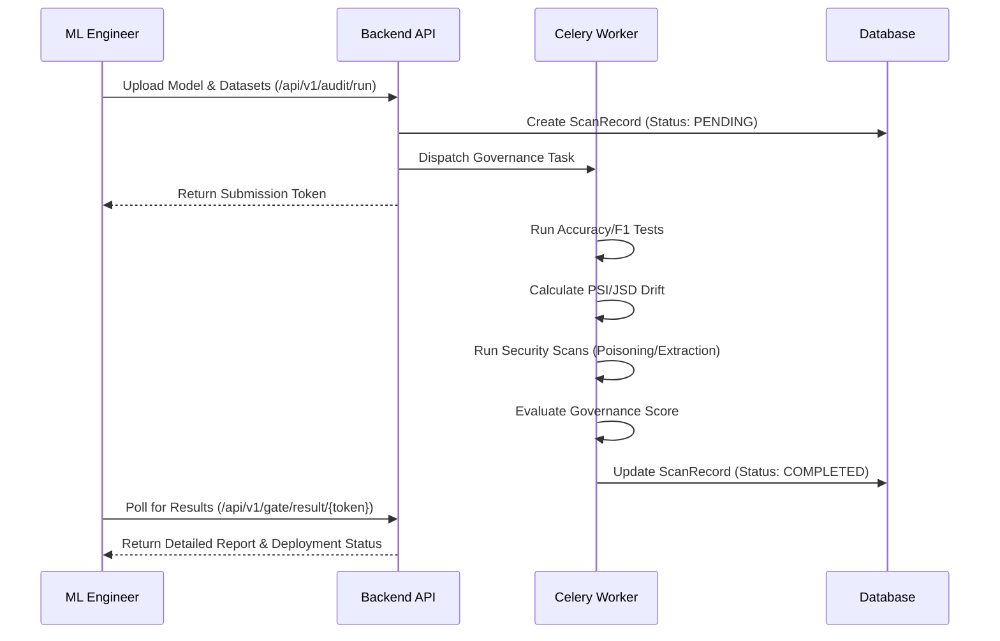
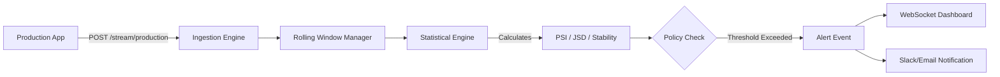

# 🛡️ ML Guard Enterprise — v8.5

## Enterprise AI Governance, Safety & Observability Platform

ML Guard is a high-performance, multi-tenant platform designed for technical AI governance. It provides a comprehensive suite of tools for offline model auditing, real-time streaming drift detection, LLM safety evaluation, and automated quality gates.

---

## 🏗️ Architecture Overview

ML Guard follows a modern distributed architecture designed for low-latency analysis and high-throughput background processing.



---

## 🔄 Core Workflows

### 1. Model Audit Lifecycle
The model audit workflow ensures that every model deployment meets enterprise standards for accuracy, fairness, and robustness.



### 2. Real-time Streaming Drift
ML Guard monitors live production traffic and detects distribution shifts before they impact business value.



---

## 🛡️ Security & Authentication

ML Guard uses a robust **X-API-Key** based authentication system with SHA-256 hashing for all protected resources.

### Using the API Key
Every request to the backend must include the `X-API-Key` header.

```bash
curl -X POST "http://localhost:8000/api/v1/llm/evaluate" \
     -H "X-API-Key: YOUR_API_KEY_HERE" \
     -H "Content-Type: application/json" \
     -d '{...}'
```

> [!IMPORTANT]
> In local development mode, use the key: `mlg_K0njzcPf5hS7AKtccxdePVglpJMiZnZX`

---

## 🔧 Getting Started

### Quick Start (Windows)
We provide a helper script to launch all services simultaneously:

1. Open PowerShell and navigate to the project root.
2. Run the startup script:
   ```powershell
   .\ml_guard\start_services.bat
   ```
This will start the **Redis Server**, **FastAPI Backend**, **Celery Worker**, and **Next.js Frontend**.

### Manual Installation

#### 1. Backend Setup
```bash
cd backend
python -m venv venv
.\venv\Scripts\activate
pip install -r requirements.txt
python -m uvicorn app.main:app --reload --port 8000
```

#### 2. Celery Worker Setup
```bash
cd backend
.\venv\Scripts\activate
celery -A app.core.celery_app worker --loglevel=info -P solo
```

#### 3. Frontend Setup
```bash
cd frontend
npm install
npm run dev
```

---

## 🛠️ Feature Matrix

| Module | Type | Status | Key Metrics |
| :--- | :--- | :--- | :--- |
| **Model Audit** | Offline | ✅ Production | Accuracy, F1, PSI/KS Drift, Calibration |
| **Streaming Drift** | Live | ✅ **Stable** | Rolling PSI, JSD, Stability Score, Brier Score |
| **LLM Guard** | GenAI | ✅ **Stable** | Toxicity, Injection, Hallucination, Stability |
| **Performance Probe**| Infra | ✅ **Stable** | p95 Latency, Error Rate, CPU/Memory Utilization |
| **Red Teaming** | Adversarial | ✅ **Stable** | Jailbreak Success, Vulnerability Mapping |
| **SHAP Explainer** | Transparency | ✅ Stable | Global/Local Feature Importance |

---

**ML Guard v8.5** — Technical AI Governance for the Modern Enterprise.
© 2026 FireFlink ML Research. Proprietary & Confidential.
